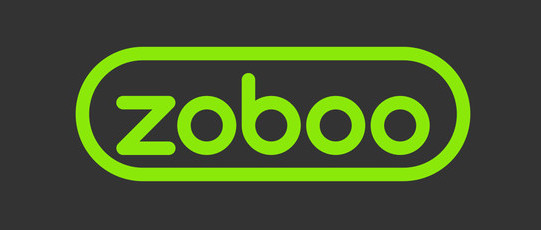

# ZobooLabyrinth

  

 
 
## :heavy_check_mark: Kullanılan Teknolojiler

## :heavy_check_mark: Kurulum

## :heavy_check_mark: Projenin Çalışma Mantığı

Projemiz single player, multi player ve bilgisayarın oynadığı oyun modlarını içermektedir. 

## :heavy_check_mark: Todo  
- [x] Single Player
- [ ] Tasarımı düzeltilecek
- [x] Bilgisayarın oynadığı mod eklenicek
- [ ] Multi Player
- [ ] Refactor
  
##  :heavy_check_mark: Proje Ekibi  

[Berkan ŞAŞMAZ](https://github.com/berkansasmaz)

[Mustafa Taha SOYDAN](https://github.com/Mtsoydan)

 ## :heavy_check_mark: Contact  
 - [Twitter](https://twitter.com/berkansasmazz)
 - [Medium](https://medium.com/@berkansasmaz)
 - [LinkedIn](https://www.linkedin.com/in/berkansasmaz/)
 - [Kişisel Web Sitesi](https://www.berkansasmaz.com)

